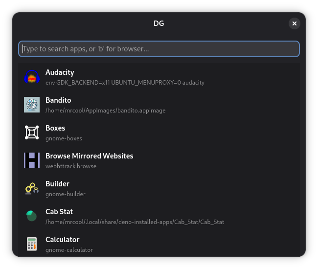

# DG Launcher

A modern, extensible application launcher built with Deno and GTK.



## Installation

Install the launcher globally using Deno:

```bash
deno install -gA --unstable-worker-options jsr:@sigmasd/dg
```

Once installed, you can launch it using the `dg` command.

Alternatively, you can download pre-built binaries from the
[Releases](https://github.com/sigmaSd/dg/releases) page, including a **portable
Windows version** that bundles the GTK runtime.

> **Tip**: For the best experience, add a global shortcut in your Desktop
> Environment (e.g., `Super+D`) to the `dg` command. Since the application stays
> in the background, it will appear instantly.

## Features

- **Extensible via TypeScript Plugins**: Enhance functionality by writing simple
  TypeScript plugins. Plugins run in a sandboxed worker environment for safety
  and stability.
- **Secure Permissions System**: Leveraging Deno's security model, plugins must
  explicitly request permissions (e.g., network access, file system). You have
  full control to grant or deny these requests.
- **Instant Access**: DG runs in the background, ensuring it appears instantly
  when you need it.
- **Built-in Tools**: Comes with an application launcher, calculator, Firefox
  history search, and a built-in plugin store to discover community extensions.

## Getting Started

### Prerequisites

- [Deno](https://deno.com/)
- GTK4 libraries

### Running

To start the launcher:

```bash
deno task start
```

Use `Ctrl+Q` to quit the application completely, or `Escape` to hide it to the
background.

## Plugin Development

Plugins are TypeScript modules that implement the `WorkerPlugin` interface. They
run in a separate worker thread and can be easily shared by publishing a package
to [JSR](https://jsr.io).

To make your plugin discoverable in the built-in store, ensure your JSR package
lists `@sigmasd/dg` as a dependency in your `deno.json`. The store uses the JSR
Dependents API to find all compatible plugins.

Example structure:

```typescript
import { WorkerPlugin } from "jsr:@sigmasd/dg/worker/client";
import type { PluginMetadata, SearchResult } from "jsr:@sigmasd/dg/interface";

export const meta: PluginMetadata = {
  id: "my-plugin",
  name: "My Plugin",
  description: "Does something cool",
  trigger: "cool", // Optional: Type 'cool <query>' to trigger (requires a space after)
};

export default class MyPlugin extends WorkerPlugin {
  async search(query: string): Promise<SearchResult[]> {
    return [{
      title: "Hello World",
      subtitle: `You typed: ${query}`,
      score: 100,
      onActivate: () => console.log("Activated!"),
    }];
  }
}
```
